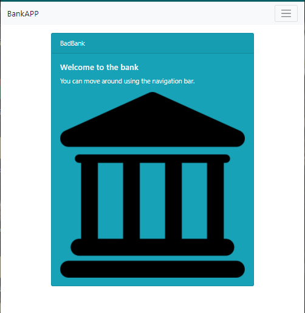

# Three-tier-app 
> Description/Motivation: 
This project is for educational purposes.

## Installation Guidelines:

- git clone https://github.com/Verson-tech/Three-tier-app.git
- [npm install](https://docs.npmjs.com/cli/v7/commands/npm-install) - install node package manager
- docker run -p 27017:27017 --name badbank -d mongo
- [http-server](https://www.npmjs.com/package/http-server) - run http-server

## Technology used:

- [HTML](https://developer.mozilla.org/en-US/docs/Web/HTML) - HTML: HyperText Markup Language
- [Bootstrap](https://getbootstrap.com/docs/5.0/getting-started/introduction/) - the world’s most popular framework for building responsive, mobile-first sites, with jsDelivr and a template starter page
- [JavaScript](https://en.wikipedia.org/wiki/JavaScript) - JavaScript, often abbreviated as JS, is a programming language that conforms to the ECMAScript specification
- [REACT](https://reactjs.org/) - A JavaScript library for building user interfaces
- [MongoDB](https://www.mongodb.com/document-databases) - Non-relational database, also known as NoSQL database, which stands for Not Only SQL
- [NODE.js](https://nodejs.org/en/) - Node.js® is a JavaScript runtime built on Chrome's V8 JavaScript engine.
- [Express](https://expressjs.com/) - Fast, unopinionated, minimalist web framework for Node.js
- [docker](hhttps://www.docker.com/) - Docker takes away repetitive, mundane configuration tasks and is used throughout the development lifecycle for fast, easy and portable application development - desktop and cloud. Docker’s comprehensive end to end platform includes UIs, CLIs, APIs and security that are engineered to work together across the entire application delivery lifecycle
- [Robo 3T](https://robomongo.org/) - Robo 3T is the MongoDB GUI

## Features:

- Please, refer to the navigation bar, which explicitly describes the features of the app
- Future improvments include authentication and authorization

## License

ISC